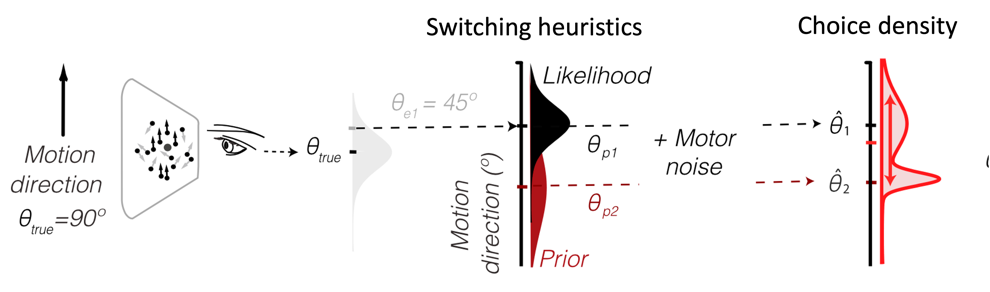

# A Switching Bayesian observer

Steeve Laquitaine & Justin L. Gardner

<p align="center">
	
</p>

Analyse and model human inference behavior in motion direction and spatial location estimation tasks in which optimality requires exploiting knowledge of the statistical distribution of the stimuli.

See also [website](http://steevelaquitaine.github.io/projInference/).

## Task

To run the task git clone the project and follow the instructions given in .../task/README.txt

1. Set your screen parameters (will run on screenNumber = 1, you can change the screen number in taskDotDir.m)

2. Open runTask
	
Run an  10º prior

```matlab
taskDotDir('steeve_exp12_metho_Pstd010_mean225_coh006012024_dir36_t107_073_033perCoh_130217')
```

or a 80º prior

```matlab
taskDotDir('steeve_exp12_metho_Pstd080_mean225_coh006012024_dir36_t106_075_034perCoh_130217')%dropped frames: 0.00 %done
```

note : taskDotDir.m loads the stimulus parameters (each trial's motion direction and coherence and a few stats) stored in a file like (e.g., 10º prior) :

```
steeve_exp12_metho_Pstd010_mean225_coh006012024_dir36_t107_074_033perCoh_controlRndInitPosSymPrior_131224.mat
```

There is one file per prior.

3. When the task is running to enter a response move your mouse to the desired direction, then press 1 on keyboard (make sure mglEditScreenParameters takes "1" as input)


## References 

Please cite:

```
@article{laquitaine2018switching,
  title={A switching observer for human perceptual estimation},
  author={Laquitaine, Steeve and Gardner, Justin L},
  journal={Neuron},
  volume={97},
  number={2},
  pages={462--474},
  year={2018},
  publisher={Elsevier}
}
```
