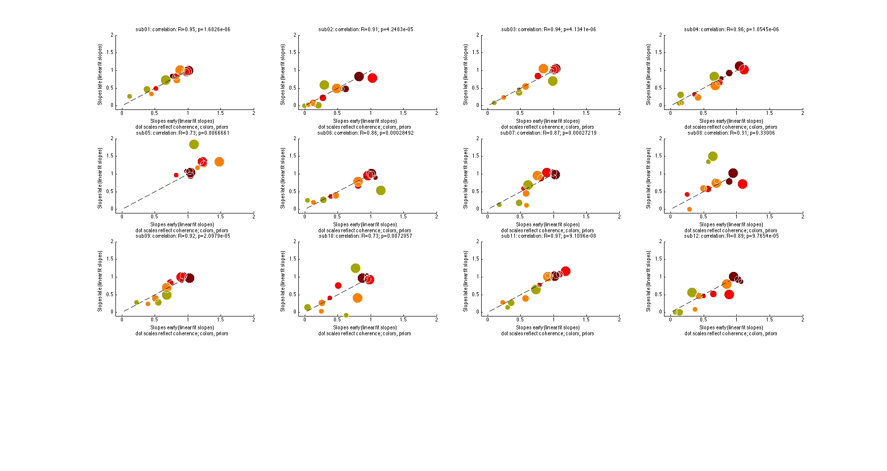

## README
_________________________
Do humans learn and use prior knowledge of motion direction statistics to improve motion direction estimation. If yes how ?

#### Descriptive analyses
(matlab)

```matlab
%initialize
>> SLinitAnalyses.m  
%run
>> analyses.m       
```

#### Inferential analyses

##### Do subject form and use beliefs about motion direction statistics in a way that is consistent with Bayesian statistical inference? 

I compared the fit of a basic Bayesian observer [Girshick et al. 2011, Nature Neuroscience] with the fit of a model that assumes fixed uniform priors to human motion direction estimation data ([see model descriptions](modeling)). Initial parameters were found for both models by manually fitting the models to the data and visually assessing the quality of the fit (see [table 2](Tables.md))

```matlab 
%basic Bayesian model
>> SLfitBayesianModel({'sub01'},[80 40 20 1.74 4.77 10.74 34.25 NaN 0.001 15 NaN],'experiment','vonMisesPrior','filename','datafit','MAPReadout','MaxLikelihoodFit','fminsearch');
>> AIC = slGetAIC(9,sum(output.Logl_pertrialBestfit));

%model assuming uniform priors
>> SLfitBayesianModel({'sub01'},[80 40 20 0 0 0 0 NaN 0.001 15 NaN],'experiment','vonMisesPrior','filename','datafit','MAPReadout','MaxLikelihoodFit','fminsearch','fixedPriors');
>> AIC = slGetAIC(5,sum(output.Logl_pertrialBestfit));
```

**Results**: The Bayesian model substantially outperformed the likelihood model for all subjects (AIClike - AICbayes >>> 2)
see [table 1](Tables.md)


##### How does incorporating prior change human direction estimates ?
They switch

##### Do subject apparently switch because they use evidence early and use prior late after learning or do they switch from the start?

We plotted a scatter of the slopes between estimate and displayed directions for 100 first versus last trials within blocks. 100 first and last are sorted for each prior and pooled across prior blocks. Trial data are linearized as data + distances to true motion direction (now range between -180 deg and 540) then averaged for each direction, coherence and prior condition. The means are then fitted with a line producing a slope estimate for each condition. 
```matlab
[linfit_early,linfit_late,r,p] = slAnalysisLearningScatterEarlyVsLateBiasAllSubjects({'sub01','sub02','sub03','sub04','sub05','sub06','sub07','sub08','sub09','sub10','sub11','sub12'},'~/data/dataPsychophy/proj01_priorStrength/','vonMisesPrior')
```
**Results**: Subjects estimates are already biased toward the prior mean since the 100 first trials which suggest that they used priors since the start.


##### We show that subject estimates already reflect prior-induced biases since first 100 trials but could still use evidence in say first 50 trials then use prior in later trials. Can we show that subject learn the prior so early that the hypothesis that switching comes from using evidence early and prior later after learning can be rejected ! How fast do subjects learn the prior? 

We added a tau parameter in a function that scales the prior K parameter between 0 and its final value (1 - e(-tau/trial number)*K). Tau and K are the fit parameters (initialize K at best fit parameter found previously [see table 3](Tables.md)): tau measures at what percent of the trials subjects reach the final k. 
**Results**: see [table 4](Tables.md).
